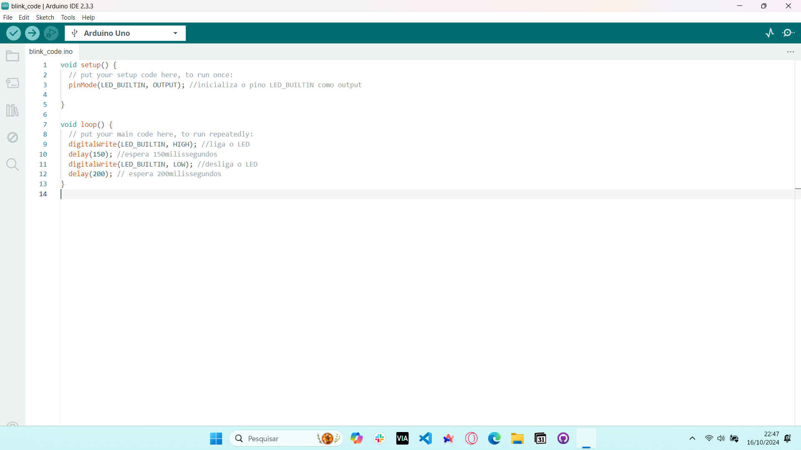
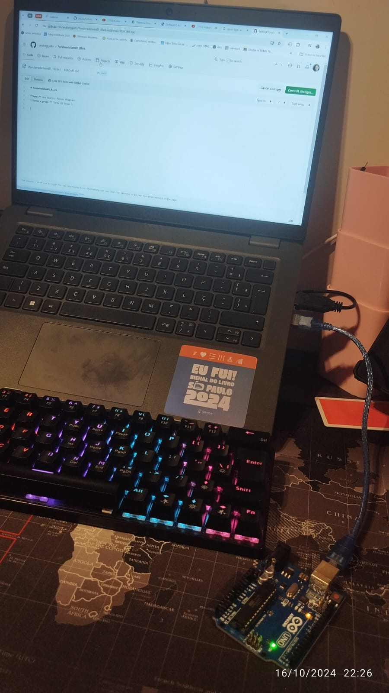

# PonderadaSem01_Blink

**Nome:** Ana Beatriz Passos Beggiato
**Turma e grupo:** Turma 12 Grupo 5

# Print da IDE do Arduino com o código:

# Foto do arduino conectado ao computador

# Vídeo de evidência do funcionamento

<video width="70%" height="240" controls>
  <source src="assets/video_evidencia.mp4" type="video/mp4">
</video>

Caso o vídeo não carregue, ele pode ser baixado do repositório ou acessado [aqui](https://www.youtube.com/embed/3x9xYfgUnRY)
