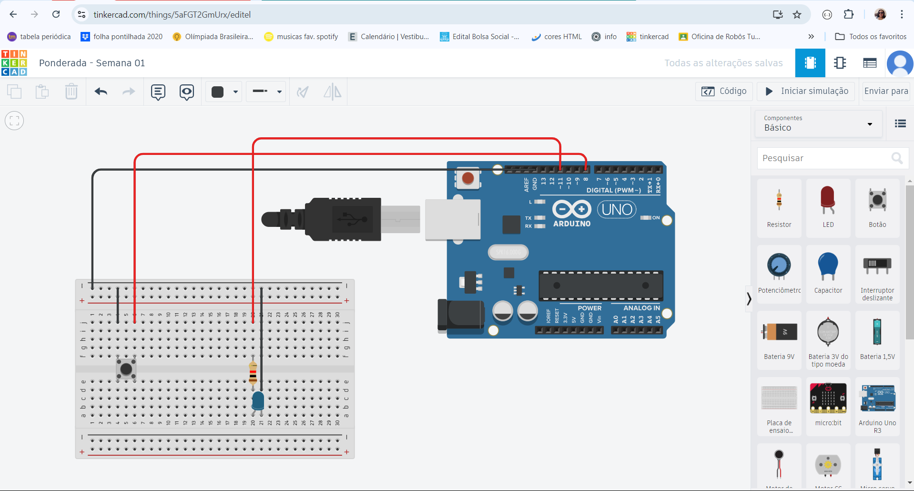
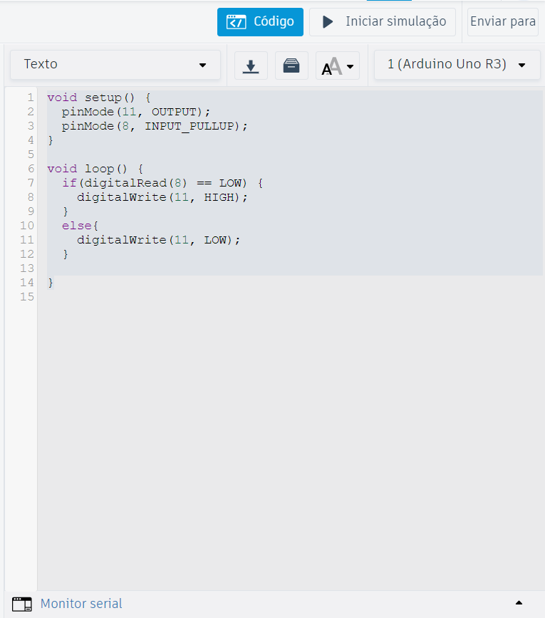

# PonderadaSem01_Blink

**Nome:** Ana Beatriz Passos Beggiato
**Turma e grupo:** Turma 12 Grupo 5

# Parte 1

## Print da IDE do Arduino com o código:

## Foto do arduino conectado ao computador

## Vídeo de evidência do funcionamento

<video width="70%" height="240" controls>
  <source src="assets/video_evidencia.mp4" type="video/mp4">
</video>

* Caso o vídeo não carregue, ele pode ser baixado do repositório ou acessado [aqui](https://www.youtube.com/embed/3x9xYfgUnRY)
* O código dessa parte encontra-se no arquivo <code>blink_led1.ino</code>

# Parte 2

## Print do esquema no TinkerCad

## Print código TinkerCad

* Caso necessário, o link do TinkerCad pode ser acessado [aqui](https://www.tinkercad.com/things/5aFGT2GmUrx/editel?sharecode=pY6AoaqYr6nx2_u5h731c0Nwp3eFEuIedwQksrkJz7Y)
* O código dessa parte encontra-se no arquivo <code>blink_led2.ino</code>